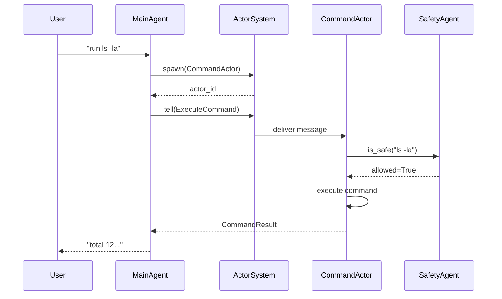

# Custom Actor Framework Design

## Overview

Design a lightweight Actor framework for the agent system where any running agent can spawn helper agents (sub-agents) for parallel task execution.

## Core Principles

1. **Message-Driven** - Actors communicate via async messages
2. **Actor Supervision** - Parent actors supervise child actors
3. **Dynamic Spawning** - Any agent can create helper agents at runtime
4. **Fault Isolation** - Crashed actors don't affect the parent

## Architecture

### Component Structure

```
src/actors/
├── __init__.py
├── base.py              # Abstract Actor base class
├── message.py           # Message types and envelope
├── system.py            # ActorSystem - global actor registry
├── supervisor.py        # Supervision strategies
└── actors/
    ├── __init__.py
    ├── command_actor.py    # Execute shell commands
    ├── web_search_actor.py # Search web
    └── context_actor.py    # Manage context
```

### Core Classes

#### 1. ActorMessage

```python
@dataclass
class ActorMessage:
    """Base message envelope for actor communication."""
    id: str                          # Unique message ID
    sender: Optional[str]            # Sender actor ID
    recipient: str                  # Recipient actor ID
    payload: Any                    # Message content
    reply_to: Optional[str]         # Where to send response
    correlation_id: Optional[str]    # For tracing related messages
    timestamp: datetime = field(default_factory=datetime.utcnow)
    message_type: str = "default"   # message, request, response, error
```

#### 2. Actor (Base Class)

```python
class Actor(ABC):
    """Abstract base class for all actors."""
    
    def __init__(self, actor_id: Optional[str] = None):
        self.actor_id = actor_id or generate_actor_id()
        self.mailbox: asyncio.Queue[ActorMessage] = asyncio.Queue()
        self.system: Optional[ActorSystem] = None
        self.parent_id: Optional[str] = None
        self.children: set[str] = set()
        self.state: ActorState = ActorState.IDLE
        self._running = False
    
    @abstractmethod
    async def receive(self, message: ActorMessage) -> None:
        """Handle incoming message."""
        pass
    
    async def tell(self, message: ActorMessage) -> None:
        """Fire-and-forget message send."""
        await self.system.send(message)
    
    async def ask(self, message: ActorMessage, timeout: float = 30.0) -> ActorMessage:
        """Request-response pattern with timeout."""
        # Implementation with Future/awaitable
        pass
    
    async def spawn_child(self, actor: "Actor") -> str:
        """Create a child actor managed by this actor."""
        pass
```

#### 3. ActorSystem

```python
class ActorSystem:
    """Global actor registry and message router."""
    
    def __init__(self):
        self.actors: dict[str, Actor] = {}
        self._message_queue: asyncio.Queue[ActorMessage] = asyncio.Queue()
    
    async def spawn(self, actor: Actor, parent_id: Optional[str] = None) -> str:
        """Register and start an actor."""
        self.actors[actor.actor_id] = actor
        actor.system = self
        actor.parent_id = parent_id
        asyncio.create_task(actor._run())
        return actor.actor_id
    
    async def send(self, message: ActorMessage) -> None:
        """Route message to recipient actor."""
        actor = self.actors.get(message.recipient)
        if actor:
            await actor.mailbox.put(message)
    
    async def stop(self, actor_id: str) -> None:
        """Gracefully stop an actor and its children."""
```

### Supervision Strategies

```python
class SupervisorStrategy(ABC):
    @abstractmethod
    def handle_failure(self, actor: Actor, error: Exception) -> SupervisionAction

class OneForOne(SupervisorStrategy):
    """Restart only the failed child."""
    
class OneForAll(SupervisorStrategy):
    """Restart all children when one fails."""

class Stop(SupervisorStrategy):
    """Stop the actor system on failure."""
```

## Integration with MainAgent

### Current vs Target Architecture

**Current (bad):**
```python
# Direct function calls - no isolation
async def handle_tool_call(tool_call):
    result = await self.command_executor.execute(command)
```

**Target (good):**
```python
# Actor-based - isolated execution
async def run(self, user_input, history):
    # Spawn command actor as helper
    command_actor = CommandActor(
        safety_agent=self.safety_agent,
        executor=self.command_executor
    )
    await self.system.spawn(command_actor, parent_id=self.actor_id)
    
    # Send message to actor
    await command_actor.tell(ActorMessage(
        recipient=command_actor.actor_id,
        payload=ExecuteCommand(command="ls -la")
    ))
```

### Actor Types for Tools

| Actor | Purpose | spawned_by |
|-------|---------|------------|
| CommandActor | Execute shell commands | MainAgent |
| WebSearchActor | Search internet | MainAgent |
| ContextActor | Analyze and archive context | MainAgent |
| SummarizerActor | Summarize long content | Any agent |
| FileActor | Read/write files | Any agent |

## Message Flow Diagram



## Spawning Helper Agents

```python
class MainAgent(Actor):
    """Main agent can spawn sub-agents dynamically."""
    
    async def receive(self, message: ActorMessage):
        if message.message_type == "spawn_subagent":
            # Dynamically create helper agent
            subagent = ToolActor(
                tool_type=message.payload["tool_type"],
                config=message.payload["config"]
            )
            await self.spawn_child(subagent)
            
            # Send task to new subagent
            await subagent.tell(ActorMessage(
                recipient=subagent.actor_id,
                payload=message.payload["task"]
            ))
```

## Error Handling

```python
class Actor:
    async def _run(self):
        self._running = True
        while self._running:
            try:
                message = await asyncio.wait_for(
                    self.mailbox.get(), 
                    timeout=1.0
                )
                await self.receive(message)
            except asyncio.TimeoutError:
                continue
            except Exception as e:
                await self._handle_error(e)
    
    async def _handle_error(self, error: Exception):
        """Send error to supervisor (parent)."""
        if self.parent_id:
            await self.system.send(ActorMessage(
                recipient=self.parent_id,
                message_type="child_error",
                payload={"actor_id": self.actor_id, "error": str(error)}
            ))
```

## Implementation Checklist

- [ ] Create `src/actors/base.py` - Actor abstract class
- [ ] Create `src/actors/message.py` - Message types
- [ ] Create `src/actors/system.py` - ActorSystem singleton
- [ ] Create `src/actors/supervisor.py` - Supervision strategies
- [ ] Implement `CommandActor` in `src/actors/actors/command_actor.py`
- [ ] Implement `WebSearchActor` in `src/actors/actors/web_search_actor.py`
- [ ] Refactor `MainAgent` to extend `Actor`
- [ ] Add actor spawning to `MainAgent.run()`
- [ ] Add error propagation from children to parent
- [ ] Write tests for actor system
