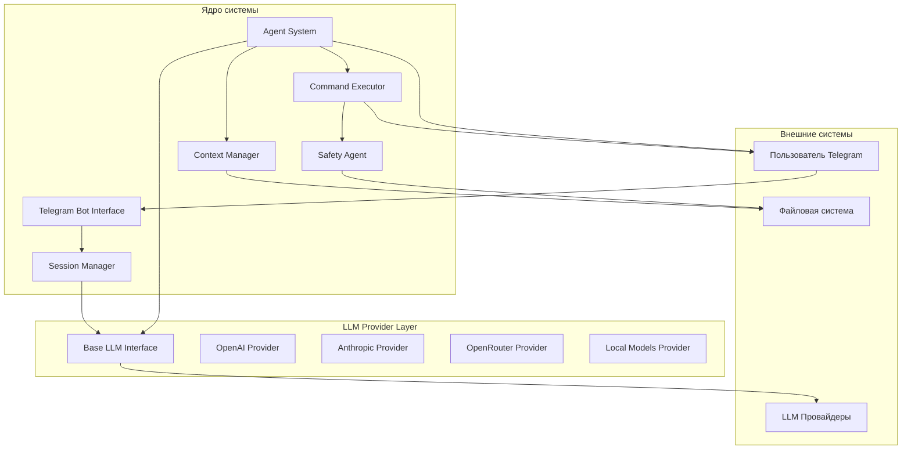
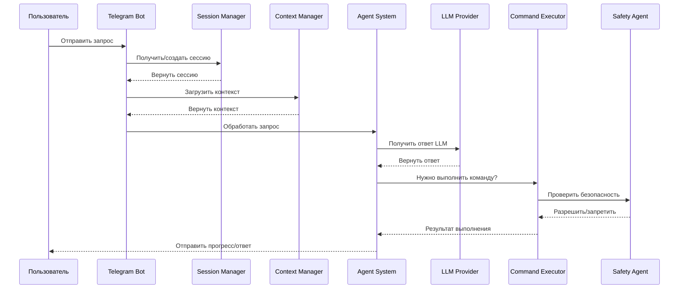

# Архитектурная документация агентной системы

## 1. Обзор системы

Агентная система представляет собой асинхронное Python-приложение, которое обеспечивает взаимодействие пользователей с LLM через Telegram-интерфейс. Система поддерживает управление сессиями, загрузку контекста из markdown-файлов, создание сабагентов и безопасное выполнение команд с предварительной проверкой через Safety Agent.

## 2. Диаграмма архитектуры



## 3. Компоненты системы

### 3.1 Telegram Bot Interface

**Ответственность:**
- Прием входящих сообщений от пользователей
- Отправка ответов и апдейтов о прогрессе
- Обработка команд и callback-запросов
- Аутентификация пользователей

**Технологии:** `python-telegram-bot` (aiogram или python-telegram-bot)
**Паттерн:** Event-driven, Message Queue для асинхронной обработки

### 3.2 LLM Provider Layer

**Ответственность:**
- Абстракция над различными LLM провайдерами
- Унифицированный интерфейс для генерации текста
- Управление токенами и лимитами
- Обработка ошибок и retry-логика
- Кеширование ответов

**Интерфейс:**
```python
class LLMProvider(ABC):
    @abstractmethod
    async def generate(self, messages: list[Message], **kwargs) -> str:
        pass

    @abstractmethod
    async def get_token_count(self, text: str) -> int:
        pass

    @abstractmethod
    async def validate_connection(self) -> bool:
        pass
```

**Паттерн:** Strategy, Adapter

**Провайдеры:**
- OpenAI (GPT-4, GPT-3.5 Turbo)
- Anthropic (Claude)
- OpenRouter (унифицированный API для множества моделей)
- Локальные модели (Ollama, LM Studio)

**Особенности OpenRouter:**
OpenRouter предоставляет унифицированный API для доступа к множеству LLM моделей от различных провайдеров через единый интерфейс. Это упрощает интеграцию для MVP, так как не требует отдельной настройки каждого провайдера. OpenRouter поддерживает десятки моделей включая GPT-4, Claude, Llama и другие. Для работы требуется API ключ с сайта openrouter.ai.

### 3.3 Session Manager

**Ответственность:**
- Создание и управление пользовательскими сессиями
- Персистентность состояния в JSON файлах
- Хранение истории диалогов
- Управление контекстом (максимальное количество токенов)
- Восстановление сессий после перезагрузки

**Технологии:** asyncio + aiofiles для асинхронной работы с файлами
**Паттерн:** Repository, File-based Storage

**Схема данных (JSON):**
```json
{
  "id": "uuid-string",
  "user_id": 123456789,
  "created_at": "2026-01-01T00:00:00Z",
  "updated_at": "2026-01-01T00:00:00Z",
  "system_prompt": "You are a helpful assistant...",
  "context_tokens": 1000,
  "messages": [
    {
      "role": "user",
      "content": "Hello",
      "timestamp": "2026-01-01T00:00:00Z"
    }
  ]
}
```

**Структура файлового хранилища:**
```
data/
├── sessions/
│   ├── {user_id}/
│   │   ├── session_{uuid}.json
│   │   └── ...
│   └── ...
└── users/
    ├── {user_id}.json
    └── ...
```

**Паттерны работы с файлами:**
- Асинхронная запись с использованием временных файлов
- Блокировка файлов при записи (asyncio.Lock)
- Атомарные операции записи

### 3.4 Context Manager

**Ответственность:**
- Загрузка markdown-файлов в контекст пользователя
- Токенизация и управление размером контекста
- Векторное индексирование для семантического поиска (опционально)
- Кеширование загруженных файлов
- Слежение за изменениями файлов

**Технологии:** tiktoken для токенизации, in-memory кеш
**Паттерн:** Lazy Loading, Cache-Aside

### 3.5 Agent System

**Ответственность:**
- Основная логика обработки запросов
- Создание и управление сабагентами
- Планирование и分解 задач
- Отправка прогресс-апдейтов пользователю
- Обработка ошибок и fallback-стратегии

**Архитектура:**
```python
class Agent:
    async def process(self, user_request: str) -> Response:
        # 1. Загрузить контекст
        # 2. Определить необходимость сабагентов
        # 3. Делегировать задачи
        # 4. Агрегировать результаты
        # 5. Вернуть ответ

    async def create_subagent(self, task: str) -> SubAgent:
        # Создание специализированного сабагента
```

**Паттерн:** Chain of Responsibility, Observer для апдейтов

### 3.6 Command Executor

**Ответственность:**
- Выполнение консольных команд
- Предварительная проверка через Safety Agent
- Потоковый вывод (stdout/stderr)
- Таймауты и контроль выполнения
- Логирование всех команд

**Технологии:** asyncio.subprocess, shlex для парсинга
**Паттерн:** Command, Proxy

### 3.7 Safety Agent

**Ответственность:**
- Анализ команд на потенциальную опасность
- Проверка списка разрешенных команд
- Семантический анализ intent
- Блокировка деструктивных операций
- Логирование всех проверок

**Правила проверки:**
- Черный список команд (rm -rf, format, del /s и т.д.)
- Проверка путей (выход за пределы рабочей директории)
- Анализ аргументов на наличие sensitive данных
- Лимиты на количество одновременных команд

## 4. Взаимодействие компонентов

### 4.1 Основной поток обработки запроса



### 4.2 Паттерн сообщений

Система использует publish-subscribe для прогресс-апдейтов:
- Agent публикует события: task_started, task_progress, task_completed, task_error
- Telegram Bot подписан на события и отправляет пользователю

## 5. Выбор технологий

| Компонент | Технология | Обоснование |
|-----------|------------|-------------|
| Язык | Python 3.11+ | Требование задачи, богатая экосистема AI |
| Асинхронность | asyncio | Высокая пропускная способность |
| Telegram Bot | python-telegram-bot | Активная поддержка, async |
| LLM клиенты | aioopenapi-client / anthropic-sdk | Асинхронные клиенты |
| Файловое хранилище | aiofiles + asyncio | JSON файлы для сессий и пользователей |
| Токенизация | tiktoken | Точный подсчет токенов |
| Логирование | structlog | Структурированные логи |
| Конфигурация | pydantic-settings | Валидация env variables |

## 6. Структура проекта

```
agents/
├── src/
│   ├── __init__.py
│   ├── main.py                    # Точка входа
│   ├── config.py                  # Конфигурация
│   ├── telegram/
│   │   ├── __init__.py
│   │   ├── bot.py                 # Telegram bot
│   │   ├── handlers.py            # Обработчики сообщений
│   │   └── callbacks.py           # Callback запросы
│   ├── agents/
│   │   ├── __init__.py
│   │   ├── base.py                # Базовый класс агента
│   │   ├── main_agent.py          # Главный агент
│   │   ├── subagent.py            # Сабагент
│   │   └── safety_agent.py        # Safety Agent
│   ├── llm/
│   │   ├── __init__.py
│   │   ├── providers/
│   │   │   ├── __init__.py
│   │   │   ├── base.py            # Базовый интерфейс
│   │   │   ├── openai.py          # OpenAI провайдер
│   │   │   ├── anthropic.py       # Anthropic провайдер
│   │   │   └── local.py           # Локальные модели
│   │   └── factory.py             # Фабрика провайдеров
│   ├── session/
│   │   ├── __init__.py
│   │   ├── manager.py             # Session Manager
│   │   ├── repository.py          # Репозиторий (JSON файлы)
│   │   └── models.py              # Pydantic модели данных
│   ├── storage/
│   │   ├── __init__.py
│   │   ├── json_store.py          # JSON хранилище
│   │   ├── file_lock.py           # Блокировки файлов
│   │   └── backup.py              # Бэкап стратегия
│   ├── context/
│   │   ├── __init__.py
│   │   ├── manager.py             # Context Manager
│   │   ├── tokenizer.py           # Токенизатор
│   │   └── cache.py               # Кеш контекста
│   ├── executor/
│   │   ├── __init__.py
│   │   ├── command.py             # Command Executor
│   │   └── security.py            # Проверка безопасности
│   └── utils/
│       ├── __init__.py
│       ├── logger.py              # Настройка логирования
│       └── helpers.py             # Вспомогательные функции
├── data/                          # Директория для JSON файлов
│   ├── sessions/                  # Сессии пользователей
│   └── users/                     # Данные пользователей
├── tests/
│   ├── __init__.py
│   ├── conftest.py
│   ├── test_agents/
│   ├── test_llm/
│   ├── test_session/
│   └── test_executor/
├── docs/
│   ├── architecture.md            # Этот документ
│   └── mvp-plan.md                # План реализации
├── configs/
│   ├── .env.example               # Пример конфигурации
│   └── settings.yaml              # YAML конфигурация
├── pyproject.toml                 # Конфигурация проекта
└── README.md
```

## 7. Паттерны проектирования

### 7.1 Основные паттерны

1. **Dependency Injection** - Все зависимости инжектируются через конструктор
2. **Factory** - Создание LLM провайдеров, агентов
3. **Repository** - Абстракция над хранилищем (файлы/БД)
4. **Strategy** - Смена LLM провайдера без изменения логики
5. **Observer** - Прогресс-апдейты для пользователей
6. **Proxy** - Safety Agent как прокси для Command Executor
7. **Chain of Responsibility** - Обработка запроса через цепочку агентов

### 7.2 Паттерны асинхронности

- **Producer-Consumer** - Очередь задач для сабагентов
- **Pub/Sub** - Событийная модель для апдейтов
- **Pipeline** - Обработка данных через последовательность трансформаций

### 7.3 Паттерны работы с файлами

- **Atomic Write** - Запись через временный файл с последующим переименованием
- **File Locking** - Блокировка файлов при одновременном доступе
- **Read-Ahead** - Предварительная загрузка часто используемых данных

## 8. Безопасность

### 8.1 Уровни защиты

1. **Network Level** - rate limiting, IP whitelist
2. **Application Level** - аутентификация пользователей
3. **Command Level** - Safety Agent проверяет все команды
4. **File System Level** - ограничение доступа к файлам

### 8.2 Защита файлового хранилища

- Файлы данных хранятся в изолированной директории
- Ограничение прав доступа к файлам (chmod 600)
- Валидация путей при работе с файлами
- Защита от path traversal атак
- Шифрование чувствительных данных (опционально)

### 8.3 Черный список команд

```python
FORBIDDEN_PATTERNS = [
    r'rm\s+-rf\s+/(?!tmp|home)',
    r'format\s+[a-z]:',
    r'del\s+/[sq]',
    r'>\s*/dev/sd',
    r'mkfs\.',
    r'dd\s+if=.*of=/dev/',
    r'chmod\s+-R\s+777\s+/',
    r'chown\s+-R\s+',
]
```

## 9. Масштабируемость

### 9.1 Ограничения файлового хранилища

- Файловые системы имеют ограничения на количество файлов в директории
- Скорость I/O операций ниже чем у базы данных
- Не подходит для высоконагруженных систем с частыми записями
- Требует ручного управления бэкапами

### 9.2 Горизонтальное масштабирование

- Stateless дизайн для агентов
- Общая файловая система (NFS) или синхронизация между инстансами
- Telegram bot может быть запущен в нескольких инстансах
- Редис для pub/sub между инстансами (прогресс-апдейты)

### 9.3 Вертикальное масштабирование

- Асинхронная архитектура для максимальной утилизации CPU
- Кеширование данных сессий в памяти
- Пул подключений к LLM
- Кул подеширование на всех уровнях

## 10. Мониторинг и логирование

### 10.1 Метрики

- Количество запросов в секунду
- Время отклика LLM
- Успешность выполнения команд
- Token usage по пользователям

### 10.2 Логирование

- Структурированные логи (JSON)
- Correlation ID для трейсинга
- Логирование в файл и stdout
- Rotation логов

## 11. Конфигурация

### 11.1 Переменные окружения

```bash
# Telegram
TELEGRAM_BOT_TOKEN=your_token
TELEGRAM_ADMIN_IDS=123456789

# LLM
LLM_PROVIDER=openai  # openai, anthropic, openrouter, local
OPENAI_API_KEY=sk-...
ANTHROPIC_API_KEY=sk-ant-...
OPENROUTER_API_KEY=sk-or-...

# Storage
DATA_DIR=./data  # Директория для JSON файлов
SESSION_TTL=86400  # Время жизни сессии в секундах
MAX_SESSIONS_PER_USER=10  # Максимум сессий на пользователя

# Security
ALLOWED_COMMANDS=ls,cd,cat,grep,tail,head
FORBIDDEN_PATTERNS=...
MAX_CONCURRENT_COMMANDS=3

# Logging
LOG_LEVEL=INFO
LOG_FORMAT=json
```

## 12. Обработка ошибок

### 12.1 Типы ошибок

| Тип | Обработка |
|-----|-----------|
| LLM Timeout | Retry с экспоненциальной задержкой, fallback на другую модель |
| Command Timeout | Принудительное завершение, уведомление пользователя |
| Rate Limit | Очередь запросов, уведомление о ожидании |
| Safety Violation | Блокировка команды, логирование, уведомление |
| Storage Error | Восстановление из бэкапа, повторная попытка записи |
| File Lock Error | Ожидание освобождения блокировки, timeout |
| Session Not Found | Создание новой сессии |

### 12.2 Circuit Breaker

Для LLM провайдеров используется circuit breaker паттерн:
- После 5 ошибок - circuit открывается
- 30 секунд wait time
- Проверка здоровья перед повторной попыткой
