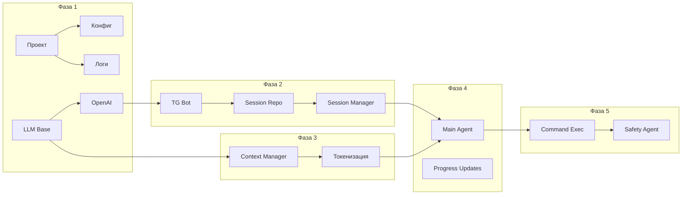

# План реализации MVP агентной системы

## 1. Обзор MVP

Минимально жизнеспособный продукт включает базовую функциональность системы без продвинутых возможностей вроде векторного поиска и сложной системы сабагентов. Фокус - на стабильной работе основного workflow.

## 2. Фазы разработки

### Фаза 1: Инфраструктура и базовые компоненты

**Продолжительность:** 2 недели

**Задачи:**

| # | Задача | Описание | Зависимости |
|---|--------|----------|-------------|
| 1.1 | Настройка проекта | Создание структуры проекта, настройка pyproject.toml, виртуальное окружение | - |
| 1.2 | Конфигурация | Создание config.py, настройка pydantic-settings, переменные окружения | 1.1 |
| 1.3 | Логирование | Настройка structlog, базовая конфигурация логов | 1.1 |
| 1.4 | JSON Storage - Base | Создание базового хранилища (async file I/O, структура директорий) | 1.1 |
| 1.5 | JSON Storage - Locking | Реализация блокировок файлов | 1.4 |
| 1.6 | LLM Provider Layer - Base | Создание абстрактного базового класса LLM провайдера | 1.1 |
| 1.7 | LLM Provider - OpenAI | Реализация OpenAI провайдера с async поддержкой | 1.6 |
| 1.8 | Модели данных | Создание Pydantic моделей для запросов и ответов | 1.1 |
| 1.9 | Unit-тесты инфраструктуры | Базовые тесты для LLM провайдеров | 1.7 |

**Критерии готовности:**
- Проект запускается без ошибок
- Логирование работает корректно
- OpenAI провайдер генерирует текст
- Конфигурация загружается из .env

### Фаза 2: Telegram Bot и Session Manager

**Продолжительность:** 2 недели

**Задачи:**

| # | Задача | Описание | Зависимости |
|---|--------|----------|-------------|
| 2.1 | Telegram Bot - Base | Настройка python-telegram-bot, создание бота, обработка /start | 1.1 |
| 2.2 | Telegram Bot - Handlers | Обработчики текстовых сообщений, команд | 2.1 |
| 2.3 | Session Manager - Repository | Создание репозитория сессий с JSON файлами | 1.5 |
| 2.4 | Session Manager - Logic | Бизнес-логика создания/восстановления сессий | 2.3 |
| 2.5 | Интеграция Bot + Session | Подключение Session Manager к Telegram Bot | 2.2, 2.4 |
| 2.6 | Логирование сессий | Сохранение истории диалогов в JSON файлы | 2.4 |
| 2.7 | Тестирование интеграции | End-to-end тесты workflow | 2.5 |

**Критерии готовности:**
- Бот отвечает на сообщения
- Сессии сохраняются между перезагрузками
- История диалогов доступна
- Обработка ошибок пользователю

### Фаза 3: Context Manager

**Продолжительность:** 1 неделя

**Задачи:**

| # | Задача | Описание | Зависимости |
|---|--------|----------|-------------|
| 3.1 | Context Manager - Base | Загрузка и парсинг markdown файлов | 1.6 |
| 3.2 | Токенизация | Интеграция tiktoken, подсчет токенов | 3.1 |
| 3.3 | Управление лимитами | Обрезка контекста при превышении лимита токенов | 3.2 |
| 3.4 | Кеширование | Кеш загруженных файлов в памяти | 3.1 |
| 3.5 | Интеграция с Agent | Подключение Context Manager к основному агенту | 2.4, 3.4 |

**Критерии готовности:**
- Markdown файлы загружаются в контекст
- Токены корректно подсчитываются
- Контекст не превышает лимиты
- Файлы кешируются

### Фаза 4: Agent System

**Продолжительность:** 2 недели

**Задачи:**

| # | Задача | Описание | Зависимости |
|---|--------|----------|-------------|
| 4.1 | Agent - Base | Базовый класс агента с async логикой | 1.4, 3.5 |
| 4.2 | Main Agent | Реализация основного агента | 4.1 |
| 4.3 | System Prompt | Настройка system prompt для агента | 4.2 |
| 4.4 | Progress Updates | Отправка апдейтов пользователю через bot | 2.2, 4.2 |
| 4.5 | Обработка ошибок | Retry логика, fallback стратегии | 4.2 |
| 4.6 | SubAgent - Basic | Базовая реализация сабагентов | 4.2 |
| 4.7 | Интеграционное тестирование | Полный workflow от сообщения до ответа | 4.6 |

**Критерии готовности:**
- Агент обрабатывает запросы и возвращает ответы
- Контекст загружается перед запросом
- Прогресс-апдейты отправляются пользователю
- Сабагенты могут быть созданы

### Фаза 5: Command Executor и Safety Agent

**Продолжительность:** 2 недели

**Задачи:**

| # | Задача | Описание | Зависимости |
|---|--------|----------|-------------|
| 5.1 | Command Executor - Base | Базовая реализация выполнения команд | 4.2 |
| 5.2 | Async Execution | Асинхронное выполнение с stdout/stderr | 5.1 |
| 5.3 | Timeout Handling | Обработка таймаутов команд | 5.2 |
| 5.4 | Safety Agent - Patterns | Проверка по черному списку паттернов | 5.1 |
| 5.5 | Safety Agent - Path Check | Проверка путей на выход за пределы директории | 5.4 |
| 5.6 | Safety Agent - Integration | Подключение Safety Agent к Command Executor | 5.4, 5.5 |
| 5.7 | Logging Commands | Логирование всех выполненных команд | 5.6 |
| 5.8 | Тестирование безопасности | Проверка блокировки опасных команд | 5.7 |

**Критерии готовности:**
- Безопасные команды выполняются
- Опасные команды блокируются
- Stdout/stderr возвращаются пользователю
- Таймауты обрабатываются корректно
- Логирование работает

### Фаза 6: Дополнительные LLM провайдеры

**Продолжительность:** 1 неделя

**Задачи:**

| # | Задача | Описание | Зависимости |
|---|--------|----------|-------------|
| 6.1 | Anthropic Provider | Реализация провайдера для Claude | 1.4 |
| 6.2 | Local Provider | Поддержка локальных моделей (Ollama) | 1.4 |
| 6.3 | Provider Factory | Фабрика для создания провайдеров | 6.1, 6.2 |
| 6.4 | Fallback Logic | Автоматическое переключение при ошибках | 6.3 |
| 6.5 | Тестирование провайдеров | Проверка всех провайдеров | 6.4 |

**Критерии готовности:**
- Все провайдеры работают корректно
- Переключение между провайдерами работает
- Fallback при недоступности провайдера

### Фаза 7: Полировка и релиз

**Продолжительность:** 1 неделя

**Задачи:**

| # | Задача | Описание | Зависимости |
|---|--------|----------|-------------|
| 7.1 | Error Messages | Пользовательские сообщения об ошибках | Все фазы |
| 7.2 | Rate Limiting | Ограничение частоты запросов | 2.5 |
| 7.3 | Backup Strategy | Реализация бэкапа JSON файлов | 2.6 |
| 7.4 | Документация | README, инструкции по запуску | Все фазы |
| 7.5 | Docker | Создание Dockerfile | 7.1 |
| 7.6 | Тестирование | Финальное тестирование all-in-one | 7.5 |
| 7.7 | Деплой | Развертывание на сервере | 7.6 |

**Критерии готовности:**
- Система стабильно работает
- Документация полная
- Docker образ собирается
- Система задеплоена

## 3. Приоритизация функционала

### Must Have (MVP)

1. Telegram Bot с базовыми командами
2. OpenAI LLM провайдер
3. Session Manager с JSON файлами
4. Context Manager для markdown
5. Основной Agent с прогресс-апдейтами
6. Command Executor с базовой безопасностью
7. Safety Agent с черным списком паттернов

### Should Have

1. Anthropic провайдер
2. Rate limiting
3. Fallback между провайдерами
4. Расширенное логирование

### Could Have

1. Локальные модели (Ollama)
2. Векторный поиск по контексту
3. Продвинутые сабагенты
4. Web interface

### Won't Have (MVP)

1. Сложная система сабагентов с иерархией
2. Multi-agent collaboration
3. Агент с памятью на несколько сессий
4. Интеграции с внешними сервисами

## 4. Зависимости между компонентами

## 5. График разработки

| Неделя | Фаза | Ключевые milestone |
|--------|------|-------------------|
| 1-2 | Фаза 1 | LLM провайдер работает |
| 3-4 | Фаза 2 | Бот сохраняет сессии |
| 5 | Фаза 3 | Контекст загружается |
| 6-7 | Фаза 4 | Agent обрабатывает запросы |
| 8-9 | Фаза 5 | Команды безопасно выполняются |
| 10 | Фаза 6 | Несколько провайдеров |
| 11 | Фаза 7 | Релиз MVP |

**Общая длительность: 11 недель**

## 6. Риски и митигация

### Риск 1: LLM провайдер недоступен

**Вероятность:** Высокая
**Влияние:** Высокое

**Митигация:**
- Реализация fallback на резервный провайдер
- Кеширование последних успешных ответов
- Retry с экспоненциальной задержкой
- Circuit breaker паттерн

### Риск 2: Безопасность Command Executor

**Вероятность:** Средняя
**Влияние:** Критическое

**Митигация:**
-多层ная проверка (pattern + path + semantic)
- Блокировка по умолчанию, разрешение только whitelist
- Логирование всех проверок
- Sandbox для выполнения команд (Docker)
- Ограничение прав процесса

### Риск 3: Rate limiting от LLM

**Вероятность:** Средняя
**Влияние:** Среднее

**Митигация:**
- Очередь запросов с приоритетами
- Троттлинг на уровне пользователя
- Кеширование идентичных запросов

### Риск 4: Повреждение файлов данных

**Вероятность:** Средняя
**Влияние:** Среднее

**Митигация:**
- Регулярный backup JSON файлов
- Атомарная запись с временным файлом
- Валидация JSON структуры при загрузке
- Логирование ошибок записи

### Риск 5: Ограничения файловой системы

**Вероятность:** Средняя
**Влияние:** Среднее

**Митигация:**
- Ограничение количества файлов в директории
- Регулярная очистка старых сессий
- Мониторинг использования диска
- Стратегия архивирования старых данных

### Риск 6: Сложность асинхронного кода

**Вероятность:** Средняя
**Влияние:** Среднее

**Митигация:**
- Стандартизация на asyncio
- Типизация (mypy)
- Extensive unit testing
- Code review

## 7. Критерии готовности MVP

### Функциональные критерии

- [ ] Пользователь может отправить запрос через Telegram
- [ ] Бот возвращает ответ от LLM
- [ ] Сессия сохраняется между перезагрузками
- [ ] Markdown файлы загружаются в контекст
- [ ] Безопасные команды выполняются
- [ ] Опасные команды блокируются
- [ ] Прогресс-апдейты отправляются пользователю

### Нефункциональные критерии

- [ ] Время отклика < 30 секунд для простых запросов
- [ ] Система обрабатывает 10+ одновременных пользователей
- [ ] Логирование работает корректно
- [ ] Обработка ошибок не крашит систему
- [ ] Конфигурация загружается из .env

### Технические критерии

- [ ] Код покрыт unit-тестами > 50%
- [ ] type hints для публичных API
- [ ] Docker контейнер собирается
- [ ] Нет уязвимостей в зависимостях

## 8. Ресурсы

### Команда

| Роль | Занятость |
|------|-----------|
| Backend Developer | 100% |
| DevOps | 20% |

### Инструменты

- IDE: VS Code / PyCharm
- Version Control: Git
- CI/CD: GitHub Actions
- Мониторинг: Sentry
- Логи: ELK Stack / CloudWatch

## 9. Последующие итерации

### Iteration 2 (После MVP)

1. Добавление векторного поиска по контексту
2. Продвинутая система сабагентов
3. Web interface
4. Multi-language поддержка

### Iteration 3

1. Агент с долгосрочной памятью
2. Интеграции (GitHub, Jira)
3. Dashboard для мониторинга
4. Продвинутая аналитика

## 10. Контрольные точки

| Дата | Контрольная точка | Ответственный |
|------|------------------|---------------|
| Конец недели 2 | Фаза 1 завершена | Developer |
| Конец недели 4 | Фаза 2 завершена | Developer |
| Конец недели 5 | Фаза 3 завершена | Developer |
| Конец недели 7 | Фаза 4 завершена | Developer |
| Конец недели 9 | Фаза 5 завершена | Developer |
| Конец недели 10 | Фаза 6 завершена | Developer |
| Конец недели 11 | MVP готов | Developer |

---

*Документ создан: 2026-02-13*
*Версия: 1.0*
